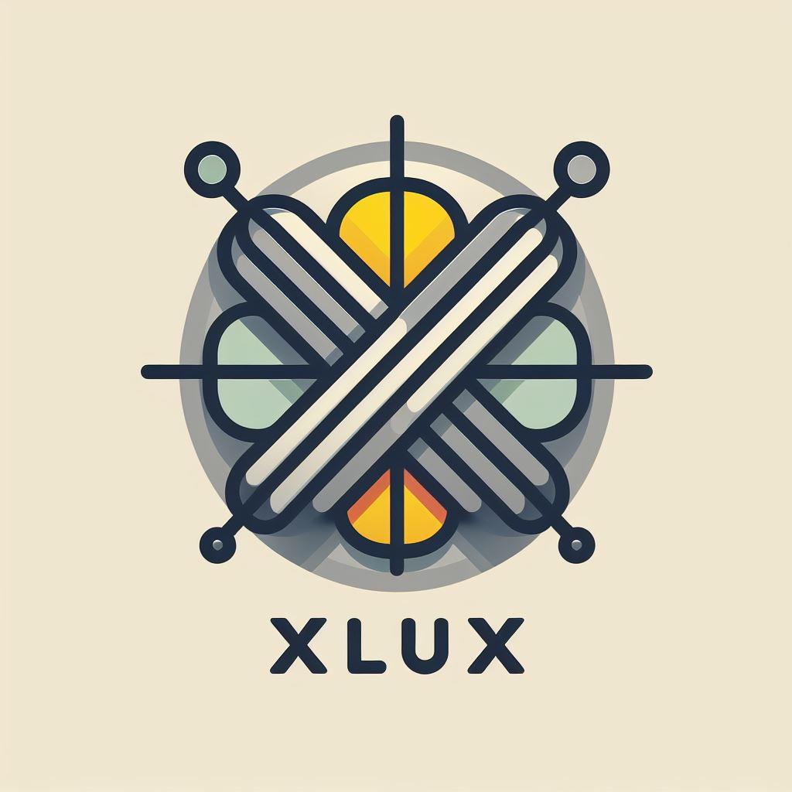
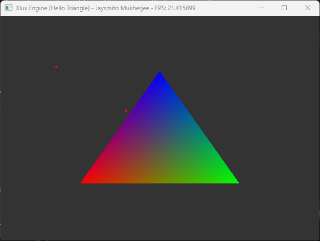
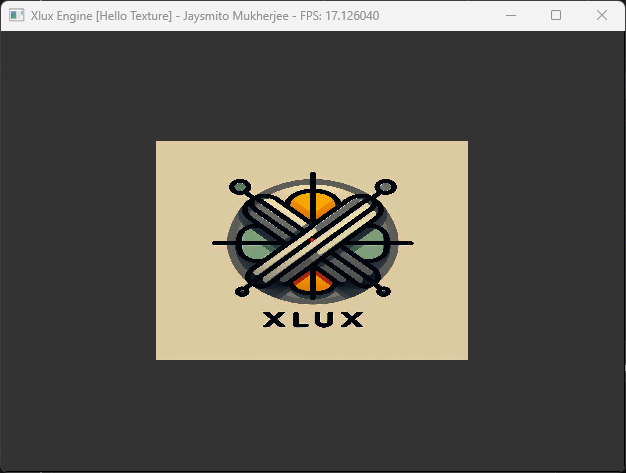
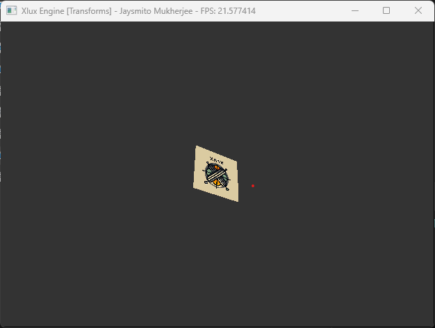
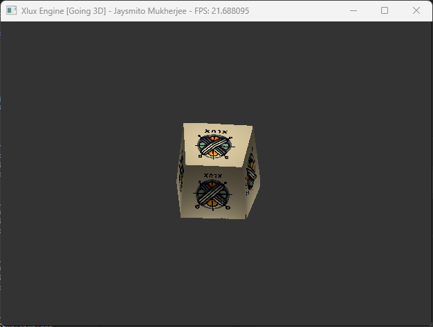
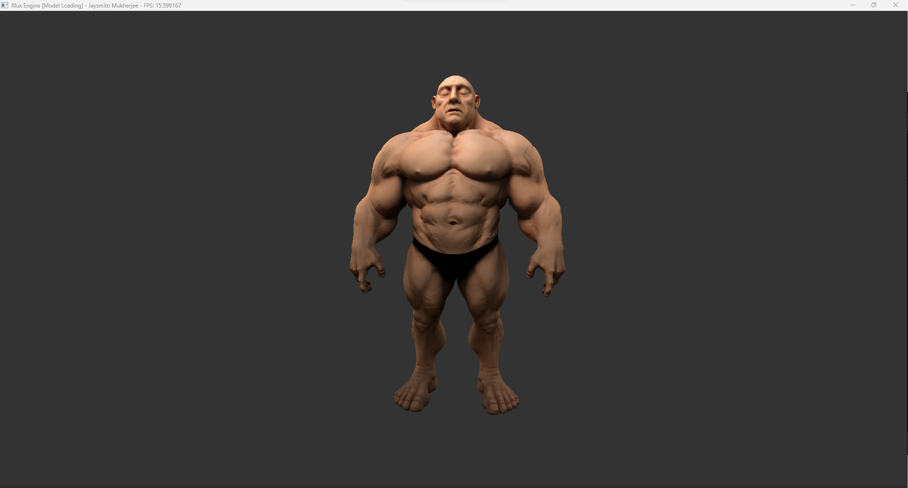
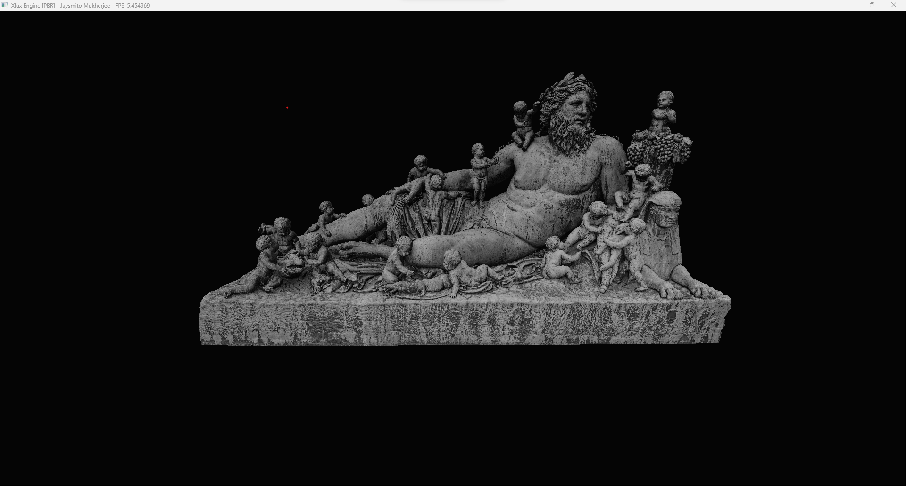
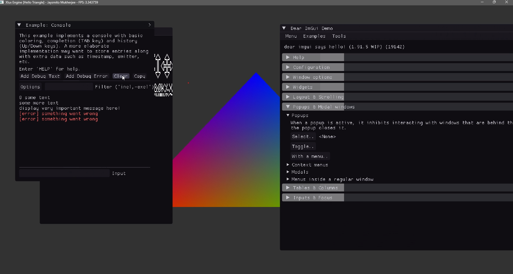

# Xlux

Xlux Engine is powerful multi-threaded Software Renderer with *zero* dependencies. It can run on any platform with C++20 available.

Xlux can ideally be used as a library and extended to whatever usage desited with a very flexible API. The forntend of the API is mostly inspited by `vulkan.hpp` but its way simpler compared to the actual vulkan API.

# Features Implemented:

* Cross Platform
* ThreadPool
* Linear Algrebra (Normal)
  - Vector (N dimensional)
  - Matrices (M x N) (and specialized 4x4 for Graphics)
  - SSE/AVX versions of Vector & Matrix (TODO)
* Custom Linear Allocator (for better performance)
* Parallel Shaders API
  - Vertex Stage
  - Fragment Stage
* Xlux Device (resource manager)
* Buffers & Device Memory
* Textures Support
  - Texture 2D
  - Cubemap (TODO)
* Framebuffers
  - Depth Supported
  - Upto 4 (can be expanded) color channels
  - extendable
* Triangle Clipping (Screen Space)
* Rastarizer
* Barycentric Interpolator
* Depth & Alpha Blending

 

# Examples

The examples for this has been made similar to https://learnopengl.com/

### Hello Triangle [source](./Sandbox/Source/01_HelloTriangle.cpp)

### Textues [source](./Sandbox/Source/02_Textures.cpp)

### Transforms [source](./Sandbox/Source/03_Transforms.cpp)

### Going 3D [source](./Sandbox/Source/04_Going3D.cpp)

### Model Loading [source](./Sandbox/Source/05_ModelLoading.cpp)

### PBR [source](./Sandbox/Source/06_PBR.cpp)

### ImGui Integration [source](./Sandbox/Source/07_ImGui.cpp)

More comming soon...

